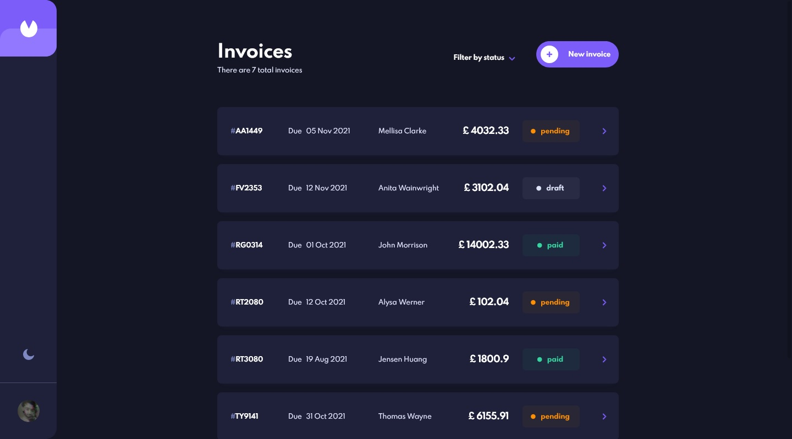

# Frontend Mentor - Invoice app solution

This is a solution to the [Invoice app challenge on Frontend Mentor](https://www.frontendmentor.io/challenges/invoice-app-i7KaLTQjl). Frontend Mentor challenges help you improve your coding skills by building realistic projects. 

## Table of contents

- [Overview](#overview)
  - [The challenge](#the-challenge)
  - [Screenshot](#screenshot)
  - [Links](#links)
- [My process](#my-process)
  - [Built with](#built-with)
- [Author](#author)

## Overview

### The challenge

Users should be able to:

- View the optimal layout for the app depending on their device's screen size
- See hover states for all interactive elements on the page
- Create, read, update, and delete invoices
- Receive form validations when trying to create/edit an invoice
- Save draft invoices, and mark pending invoices as paid
- Filter invoices by status (draft/pending/paid)
- Toggle light and dark mode

### Screenshot

### Links

- Solution URL: [Frontend Mentor](https://www.frontendmentor.io/solutions/personal-invoice-app-with-vue-and-firebase-dN6W4EdRH)
- Live Site URL: [Netlify](https://affectionate-banach-1b386a.netlify.app)

## My process

### Built with

- Flexbox
- CSS Grid
- Mobile-first workflow
- Vue 3
- Vue Router
- Vuex
- Firebase

## Author

- Github - [UnTalPeluca](https://github.com/UnTalPeluca)
- Frontend Mentor - [@UnTalPeluca](https://www.frontendmentor.io/profile/UnTalPeluca)
